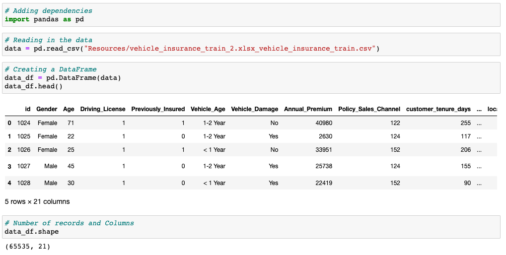
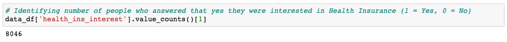
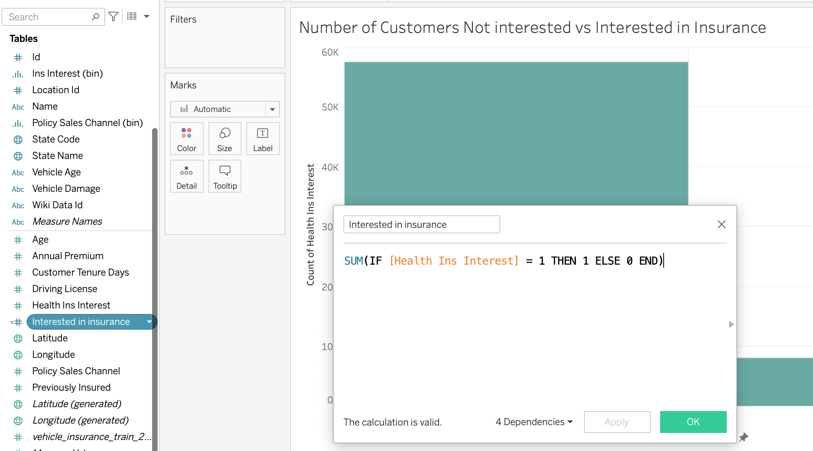
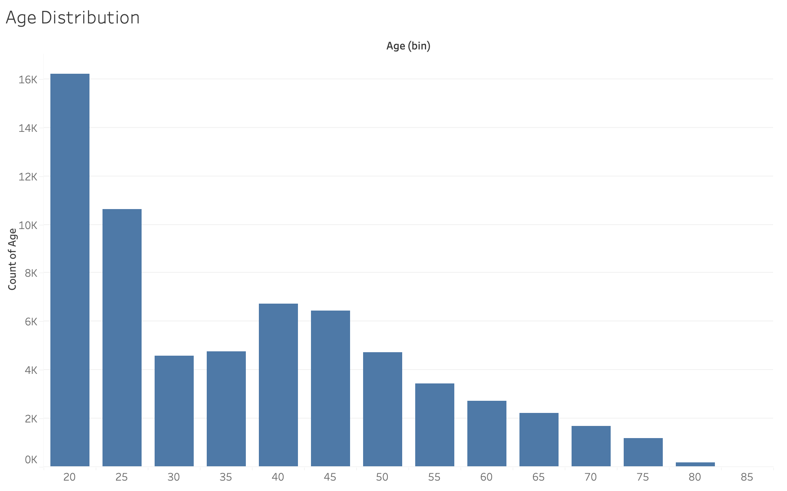
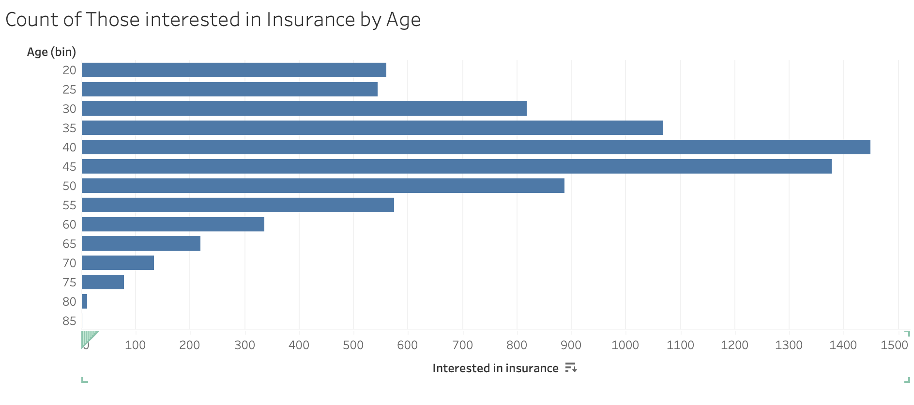
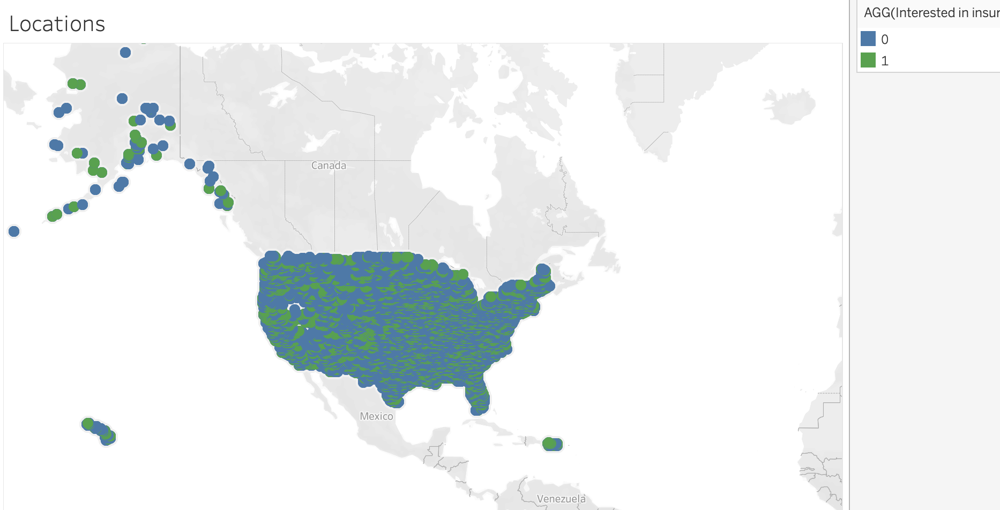

# Insurance-Cross-Sell

The purpose of this project is to look for trends in insurance data that may lead to a more narrow target profile for cross selling other insurance products. The sample includes data for a group of people insured for vehicles who have been surveyed for interest in other insurance products, specifically health care insurance. 

The vehicle insurance data from Kaggle which was transfered over from Analytics Vidhya. Location data was sourced to give the sample some geography but its application was basically random. It also came from Kaggle. An id column was added to provide a primary key for joining the two datasources. A few cleaning steps were then added to clarify column names.  

The data was exported from Alteryx and read into a Jupyter Notebook for some analysis with Python. Of the 65,535 records in this sample, 8,046 (12.2%) reported that they were in fact interested in purchasing health insurance. 

The data was also uploaded to Tableau for visual analysis.A calculated field was created to separate the interested individuals from not interested in order to compare with other variables to look for trends.

Looking at the age distribution, it appears that the sample is skewed towards more younger aged individuals.  

However, it looks like more middle aged people are actually interested in health insurance. 

                                                    

Our location distribution appears to be spread pretty evenly accross the United States and its Territories. 

