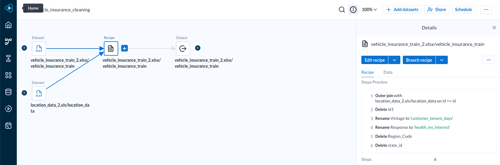

# Insurance-Cross-Sell

The purpose of this project is to look for insurance data trends that may lead to a more narrow persona profile to target for cross selling other insurance products. The sample includes data for a group of people insured for vehicles who have been surveyed for interest in other insurance products, specifically health care insurance. 

## Resources
  * Alteryx
  * Tableau
  * Python

## Investigation

The vehicle insurance data was sourced from Kaggle which was transfered over from Analytics Vidhya. The Location data, also from Kaggle, was added to give the sample some geography but its application was random. An Id column was added to provide a primary key for joining the two datasources. A few cleaning steps were then added to clarify column names.  

The data was exported from Alteryx and read into a Jupyter Notebook for some analysis with Python. Of the 65,535 people surveyed in this sample, 8,046 (12.2%) reported that they were in fact interested in purchasing health insurance. 

The data was also uploaded to Tableau for visual analysis. A calculated field was created to separate the interested individuals from not interested in order to compare with other variables for trend analysis.

Looking at the age distribution, it appears that the sample is skewed towards more younger aged individuals than older or middle aged people.  

However, it looks like more middle aged people are actually interested in health insurance than older or younger people. 

                                                    

It also appears that people with newer vehicles ( <2 years old) are more interested in health insurance than older vehicles ( >2 years old). 

Our location distribution appears to be spread pretty evenly accross the United States and its Territories. 

That being said, it does apear that some states are standing out as having more people interested in cross-sell opportunities. Specifically, California, Texas, Florida, Illinois, New York, and Pennsylvania. This may be a function of population to some extent but further investigation should be done in this area.  

## Summary and Next Steps
After a preliminary review of the data, some useful insights can be drawn but more investigation should be conducted. At a high level, it looks like vehicle insurance customers who are more middle aged, with newer vehicles, and residing in a handful of select states are more likely to be interested in also purchasing health insurance. 

To investigate further, some recommendations should be noted. First, this preliminary round of investigation was largely based on visual trends, so more quantitative analysis is recommended. This should include descriptive statistics and correlations among the data with interest in health insurance. After reviewing the results, some columns may be dropped. Additionally, Machine Learning could be applied to investigate predictability of interest in health insurance with different algorithms.  
